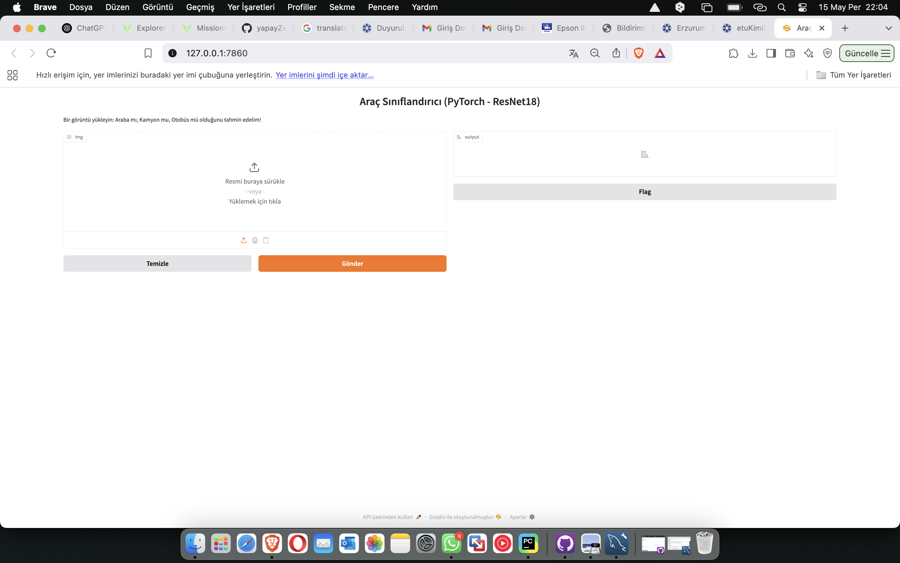
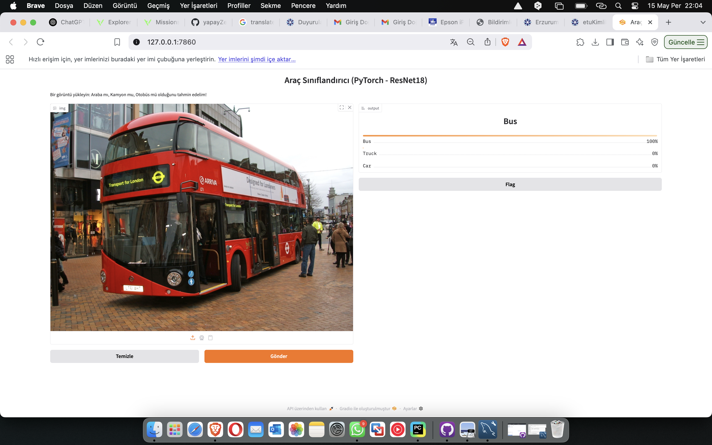

# Araç Sınıflandırma Projesi

Bu proje, farklı araç türlerini sınıflandırmak için geliştirilmiş bir görüntü işleme ve makine öğrenmesi sistemidir. Derin öğrenme temelli bu sistem, kullanıcıdan alınan araç görselini analiz ederek `Car`, `Bus`, `Truck`, `Motorcycle` gibi kategorilere ayırır. Arka planda PyTorch kütüphanesi kullanılarak eğitilmiş bir ResNet18 modeli çalışır. Kullanıcı dostu bir arayüz için Gradio entegrasyonu mevcuttur.

---

## Özellikler

- Önceden eğitilmiş ResNet18 modeli ile transfer learning
- Eğitimden sonra model `.pth` dosyası olarak kaydedilir
- Eğitim yapılmışsa tekrar eğitim yapılmaz, model doğrudan yüklenir
- Eğitim sonrası doğruluk ve kayıp grafikleri çizilir
- Confusion matrix ve classification report gösterilir
- Görsel yükleyerek tahmin yapmaya imkân tanıyan Gradio arayüzü

---

## Klasör Yapısı

```
yapayZekaBulutProje/
├── Dataset/
│   ├── Car/
│   ├── Bus/
│   ├── Truck/
│   └── motorcycle/
├── main.py
├── vehicle_classifier_resnet18.pth
└── README.md
```

---

## Kurulum

Gerekli Python kütüphanelerini yüklemek için aşağıdaki komutu çalıştırabilirsiniz:

```bash
pip install torch torchvision matplotlib seaborn scikit-learn gradio
```

---


## Veri Seti Hazırlığı

Veri seti klasör yapısı `torchvision.datasets.ImageFolder` formatına uygun olmalıdır. Örnek bir yapı aşağıdaki gibidir:

```
Dataset/
├── Car/
├── Bus/
├── Truck/
└── motorcycle/
```

Her klasör, o sınıfa ait görüntüleri içermelidir.

---

## Kullanım

Projenin ana Python dosyasını çalıştırarak sistemi başlatabilirsiniz:

```bash
python main.py

```
## Arayüz





## Sonuç




### Çalışma Mantığı:

- Eğer daha önce eğitilmiş bir model dosyası (`vehicle_classifier_resnet18.pth`) varsa:
  - Bu model otomatik olarak yüklenir.
  - Eğitim adımı atlanır.
  - Gradio arayüzü doğrudan başlatılır.
- Eğer model dosyası yoksa:
  - Eğitim süreci başlatılır.
  - Eğitim tamamlandıktan sonra model kaydedilir.
  - Eğitim grafikleri ve analizler gösterilir.
  - Gradio arayüzü başlatılır.

---

## Gradio Arayüzü

Kullanıcıdan alınan bir görüntüyü analiz ederek 3 olası sınıfın tahmin sonuçlarını yüzde değerleriyle birlikte sunar.

- Görsel yükleyin veya sürükleyip bırakın
- Sistem tahminlerini anında gösterir
- Kullanıcı dostu ve etkileşimli

---

## Eğitim Sonuçları

- **Doğruluk & Kayıp Grafikleri**  
  Eğitim ve doğrulama setlerine ait doğruluk ve kayıp değerleri görsel olarak çizilir.

- **Confusion Matrix**  
  Modelin hangi sınıfları doğru/yanlış tahmin ettiğini gösteren matris.

- **Classification Report**  
  Precision, recall ve F1-score değerlerini içerir.

---

## Örnek Veri Setleri

Aşağıdaki açık kaynak veri setleri ile bu proje uyumludur:

- [Vehicle Detection Image Set (Kaggle)](https://www.kaggle.com/datasets/mohamedhanyyy/vehicle-detection-image-set)
- [Stanford Cars Dataset](https://ai.stanford.edu/~jkrause/cars/car_dataset.html)
- [CompCars Dataset](http://mmlab.ie.cuhk.edu.hk/datasets/comp_cars/)

---

## Katkıda Bulunmak

Projeye katkıda bulunmak isterseniz `fork` edip `pull request` gönderebilirsiniz. Daha fazla sınıf eklemek, farklı modeller denemek veya iyileştirme önerileriniz varsa katkılarınızı bekliyoruz.

---

## Lisans

Bu proje eğitim amaçlıdır ve açık kaynak lisansı ile sunulmaktadır.

